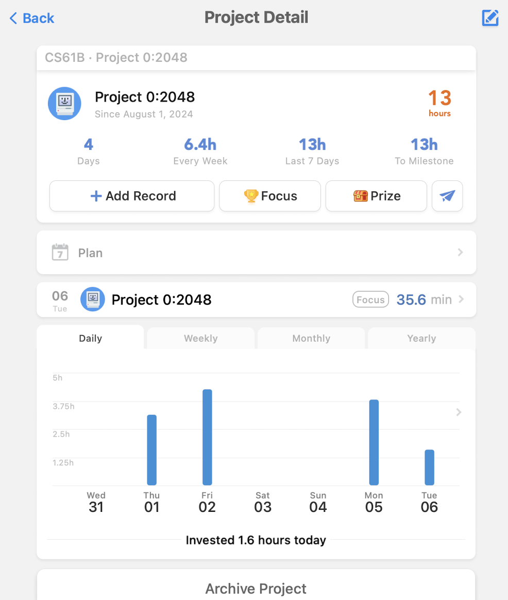
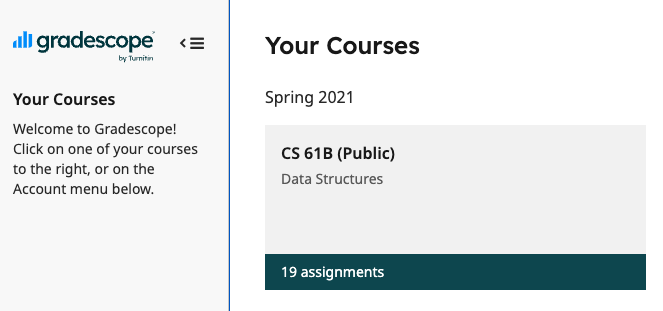
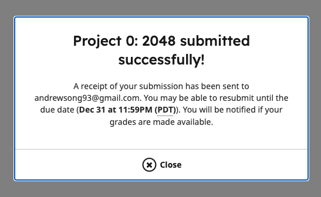
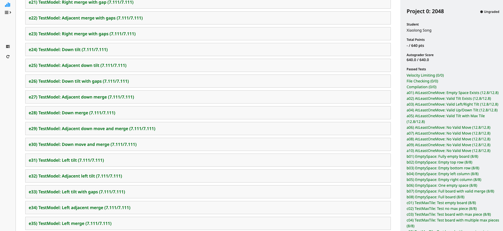
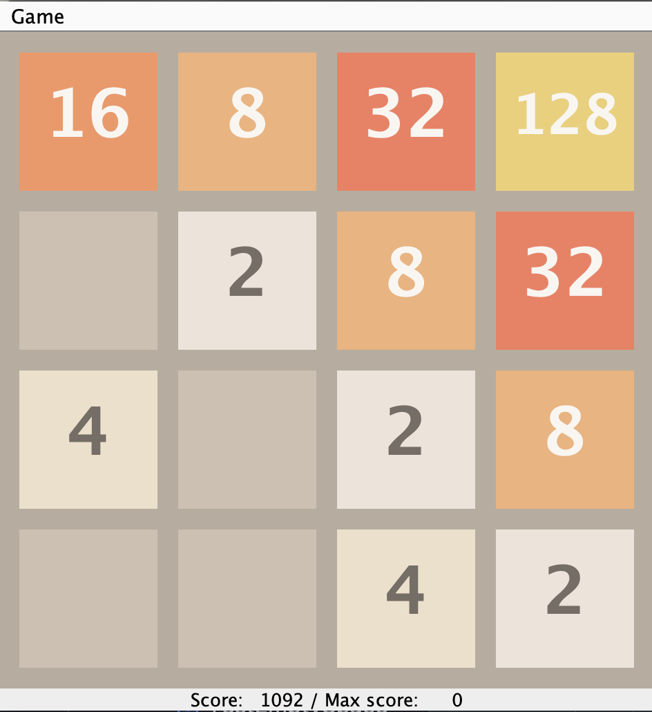
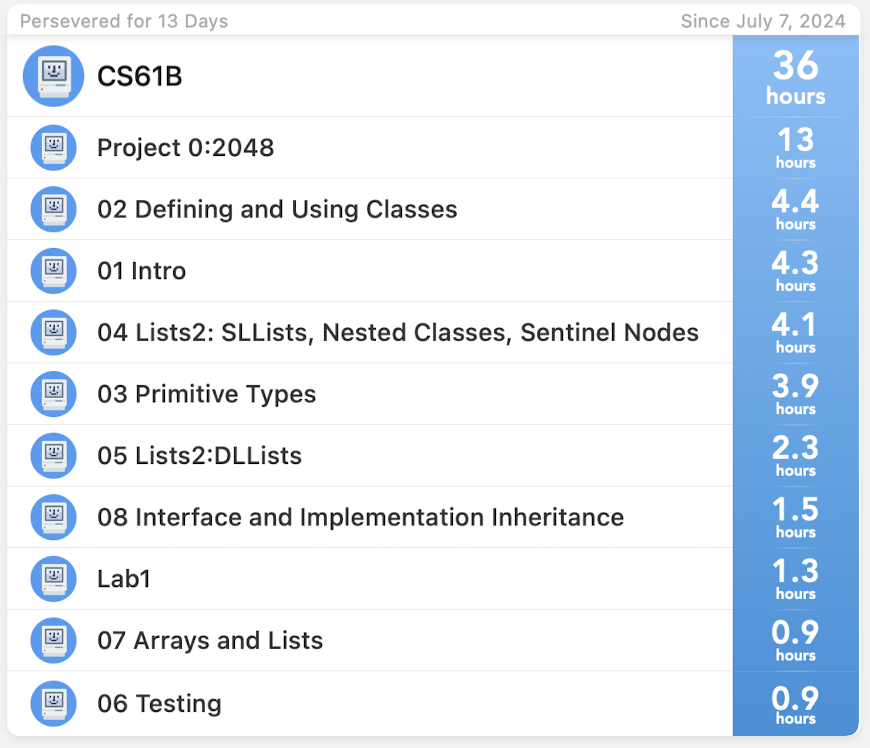

# cs61b-sp21
study notes of ucb cs61b-sp21 data structure and algorithm

**2024/08/01**
- Finished lab1, 
  - time cost:1.3h
  - changes from sp21 need to notice: command for git push `git push origin **master**` changed into `git push origin **main**`

**2024/08/06**
- Finished [project0:2048](https://sp21.datastructur.es/materials/proj/proj0/proj0)
- time cost: 13h
  
- submission record: submitted at [gradescope](https://www.gradescope.com/), with course code provided by UC Berkeley, thanks for knowledge sharing!
  
  
- full grade get
  

- Project0_2048
  
  oops, just found the 'maxscore' didn't update, althogh the code has passed all the tests
- time cost inttal for cs61b (up to now):36h
  