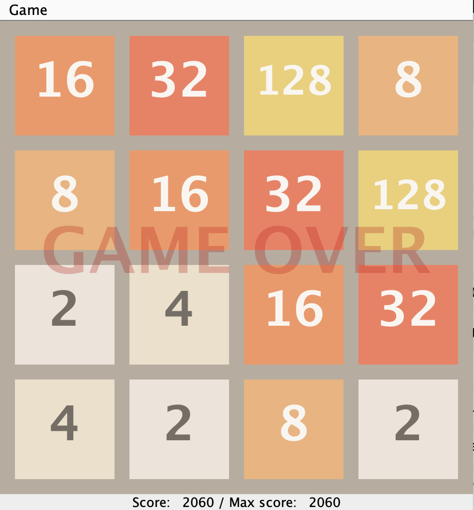

# cs61b-sp21
study notes of ucb cs61b-sp21 data structure and algorithm

**2024/10/10**
- Finished lab2
- time cost: 3h

**2024/08/06**
- Finished [project0:2048](https://sp21.datastructur.es/materials/proj/proj0/proj0)  
- time cost: 13h  
    

- submission record: submitted at [gradescope](https://www.gradescope.com/), with course code provided by UC Berkeley, thanks for knowledge sharing!  
    
    

- full grade get  
    

- Project0_2048  
    
  oops, just found the 'maxscore' didn't update, although the code has passed all the tests.  
    
  update, modified score and maxScore funtions  
      
  update, misunderstood the game score rule, actually the first submission is right, the maxScore only displayed at the moment of game over.  
(maybe this is coding :bug: :sob: :smiley: ).  
- time cost total for cs61b (up to now):36h  
  

**2024/08/01**
- Finished lab1, 
  - time cost:1.3h
  - changes from sp21 need to notice: command for git push `git push origin **master**` changed into `git push origin **main**`